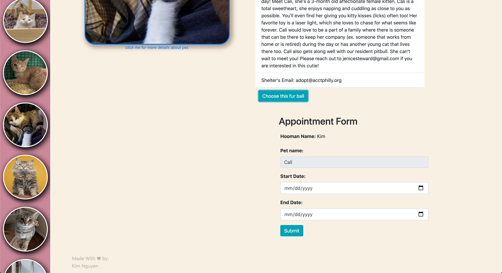

# petopia-frontend
* Please refer to petopia-backend through this repo: https://github.com/nnhk23/petopia-backend.

# Instruction: 
* Clone both repo: petopia-frontend and petopia-backend in a same folder.
* Change directory to petopia-backend: ```cd petopia-backend```
* Run ```ruby rails db:migrate``` and ```ruby rails db:seed```.
* Start server: ```ruby rails s```.
* Go back to parents folder by ```cd ..```.
* Open petopia-frontend: ```cd petopia-frontend```
* Open index.js file in browser: ```open index.html```
* Enjoy Petopia App :). 

# Petopia (frontend)

Petopia is a foster website using real pets data from shelters. You can book a date with our pets and view it on a calendar.

## Getting Started

These instructions will get you a copy of the project up and running on your local machine for development and testing purposes. See deployment for notes on how to deploy the project on a live system.

Link to Petopia's backend: https://github.com/nnhk23/petopia-backend.

## Start

(make sure to also complete backend's installation instruction before strating the program :) )

Run ```open index.html```

**Landing page:**


**Pet Information Page:**


**Appointment Details Form:**


**Calendar with appointment's date and details:**


**Rescheduling Form:**


**View all appointments:**


## Built With

* HTML
* Vanilla Javascript.
* Custom CSS.

## Features
**Account(C)**
* User can sign up/log in by typing their name in landing page.
* User will automatically be logged in if name already exist in database.

**Appointments (CRUD)**
* User can book an appointment to foster a pet.
* User can cancel appointment with pet.
* User can adjust date of appointment.
* User can see all booked appointments.

**Pet (R)**
* User can view pet details by clicking on pet's photo on side nav.
* User can open external link to foster pet by clicking on pet's profile photo on details page.
* User can view appoinment details on calendar.

## Authors

* **Kim Nguyen** - [Github Link](https://github.com/nnhk23)

## License

This project is licensed under the MIT License - see the [LICENSE.md](LICENSE.md) file for details

## Final Note
Feel free to contact me via github or my email via nnhk23@gmail.com. Happy coding! :)